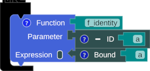
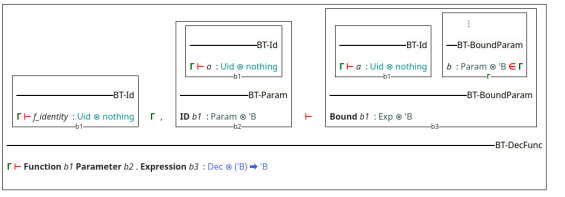

# The Compiler

MNL has a compiler named YAKI (Yet Another [K/C]Compiler Interface). It transforms block-based programming languages into text-based languages such as SML and Scala. Beyond compiling, YAKI could write a typing derivation of MNL.

Users can access YAKI by right-clicking on the workspace and choosing `Compiler` to open the transpiler window. The combo box at the bottom allows users to select the target language.


## Example: The Identity Function

??? Note "The Identity Function"
    :man_raising_hand: The identity function is a function that returns the input value.


{title="the identity function"}

/// caption
Fig. 1: The identity function
///

=== "Typing Derivation"

    

=== "SML"

    ``` sml title="identity_function.sml" linenums="1"
    fun f_identity (a) = a
    ```

=== "Scala"

    ``` scala title="identity_function.scala" linenums="1"
    def f_identity [B] (a : B) : B = a 
    ```
