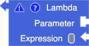
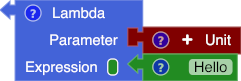
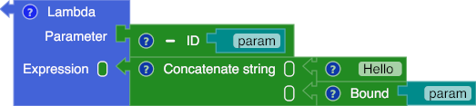
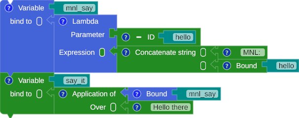
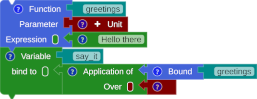
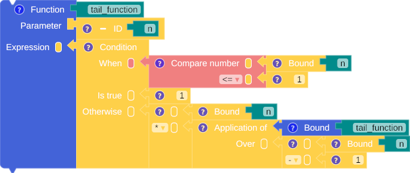
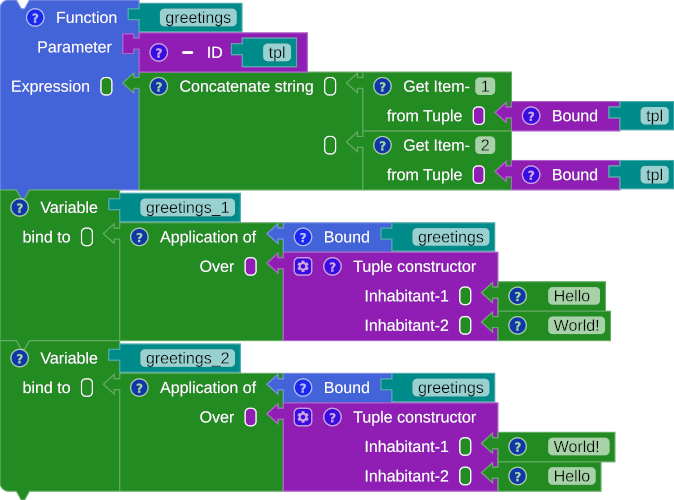
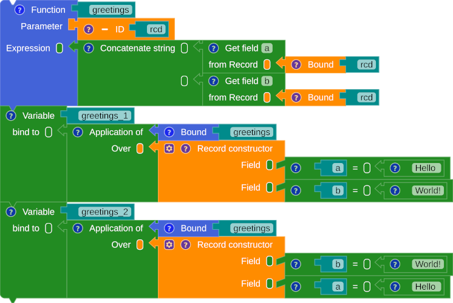

# The Function

As in functional programming, MNL treats a function as a first-class citizen, meaning it can be bound to names, passed as an argument, and returned from another function. MNL has two types of function blocks: The function block and the lambda block. 
The lambda block is an expression block that takes two inputs: a parameter and an expression block. On the other hand, the function block is a declarative block that consists of three inputs: an identifier (a name), a parameter, and an expression block.


## The Lambda Block
A lambda function, also known as an anonymous function, is a function that does not have a name. Figure 1 shows an incomplete lambda block, while Figures 2 to 4 provide examples of how to construct a lambda block.

{title="Lambda"}

/// caption
Fig. 1: The lambda block
///

{title="Lambda - unit to string"}

/// caption
Fig. 2: The lambda block with the empty parameter and return a string
///

{title="Lambda - hello"}

/// caption
Fig. 3: The lambda block with a string input and produce a string output
///

Naming a lambda block can be achieved by connecting the variable block with the lambda block.

{title="The lambda block binding with a name"}

/// caption
Fig. 4: Lambda binding with a name.
///

=== "SML"

    ``` sml linenums="1"
    val mnl_say = fn (hello) => ("MNL: " ^ hello)
    val say_it = mnl_say("Hello there")
    ```

=== "Scala"

    ``` scala linenums="1"
    val mnl_say = (hello : String) => ("MNL: " + hello)
    val say_it = mnl_say("Hello there")
    ```


## The Function block

MNL simplifies the connection between the lambda block and the variable block within a single declaration block known as a function block.

{title="First class function"}

/// caption
Fig. 5: The function block
///

=== "SML"

    ``` sml linenums="1"
    fun greetings () = "Hello there"
    val say_it = greetings()
    ```

=== "Scala"

    ``` scala linenums="1"
    def greetings () : String = "Hello there"
    val say_it = greetings()
    ```

## Example

### Tail Function

{title="Tail function"}

/// caption
Fig. 6: The tail function
///

=== "SML"

    ``` sml linenums="1"
    fun tail_function (n) = if (n <= 1)
        then
            1
        else
	        (n * tail_function((n - 1)))
    ```

=== "Scala"

    ``` scala linenums="1"
    def tail_function (n: Float) : Float = if (n <= 1)
        then
            1
        else
            (n * tail_function((n - 1)))
    ```

### Two or more parameters

The core language of MNL is the lambda calculus, which takes one parameter. However, MNL can use a tuple or a record to accommodate two or more inputs as parameters. The examples below illustrate how to group two inputs into a single parameter.

#### Tuple

{title="tuple"}

/// caption
Fig. 7: A tuple as the function parameter
///

=== "SML"

    ``` sml linenums="1"
    (* SML does not support type inference for a tuple as a parameter. 
    Other ML languages may support the syntax below. *)
    ```

=== "Scala"

    ``` scala linenums="1"
    /* the first item name/ index is 0 in scala */
    def greetings (tpl: (String, String)) : String = ((tpl(0)) + (tpl(1)))
    val greetings_1 = greetings(("Hello ", "World!"))
    val greetings_2 = greetings(("World!", "Hello "))
    ```

#### Record

{title="record"}

/// caption
Fig. 8: A record as the function parameter
///

=== "SML"

    ``` sml linenums="1"
     (* SML does not support type inference for a record as a parameter. 
    Other ML languages may support the syntax below. *)
    ```

=== "Scala"

    ``` scala linenums="1"
    /* Scala doesn't have primitive type of 'Record' */
    ```
