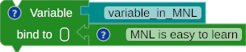
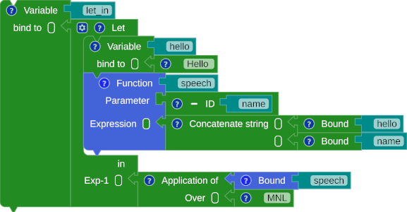

# Getting Started

## Just Drag, Drop, and Attach the block

<div class="annotate" markdown>

To start constructing a program in MNL, drag a block from the toolbox to the playground area and attach it to another block.
A main block (1) acts as the parent block. The main block holds the declaration block only.

</div>

1. :man_raising_hand: The black block with MNL on the top.

{title="Drag, drop, and attach the block" loading=lazy }
{title="Drag, drop, and attach the block" loading=lazy }

/// caption
Fig. 1: Drag, drop, and attach the block
///

## Declaration

A declaration means binding a name to a value. In MNL, there are two declaration blocks: variable and function.
[The function block](function.md#the-function) is a simple model of binding a variable block with a lambda block.

### Variable

Creating a complete variable block requires an identity block and an expression block. The example below shows how to give a `variable_in_MNL` name to the string `MNL is easy to learn.` When users need the `MNL is easy to learn` value, they access the bound variable by name `variable_in_MNL`.

{title="Variable binding" loading=lazy }

/// caption
Fig. 2: Variable binding
///

=== "SML"

    ``` sml linenums="1"
    val variable_in_MNL = "MNL is easy to learn"
    ```

=== "Scala"

    ``` scala linenums="1"
    val variable_in_MNL = "MNL is easy to learn"
    ```

## Expression

Expression is a value. Every expression block has its value, including operators, constants, and constructors.

### Operator

<div class="annotate" markdown>

There are two types of primitive operators based on input: unary (1) and binary (2) operators.

</div>

1. :man_raising_hand: Take one input.
2. :man_raising_hand: Take two inputs.

#### Unary

{title="Boolean Operator Not" loading=lazy }

/// caption
Fig. 3: Boolean Operator Not
///

=== "SML"

    ``` sml linenums="1"
    (not false)
    ```

=== "Scala"

    ``` scala linenums="1"
    (!false)
    ```

{title="Boolean Operator Not - binding" loading=lazy }

/// caption
Fig. 4: Boolean Operator Not - binding
///

=== "SML"

    ``` sml linenums="1"
    val unary_operator = (not false)
    ```

=== "Scala"

    ``` scala linenums="1"
    val unary_operator = (!false)
    ```

#### Binary

{title="Arithmetic Operator" loading=lazy }

/// caption
Fig. 5: Arithmetic Operator
///

=== "SML"

    ``` sml linenums="1"
    (111 + 222)
    ```

=== "Scala"

    ``` scala linenums="1"
    (111 + 222)
    ```

{title="Arithmetic Operator - binding" loading=lazy }

/// caption
Fig. 6: Arithmetic Operator - binding
///

=== "SML"

    ``` sml linenums="1"
    fun increment (n) = (1 + n)
      val three = increment(2)
    ```

=== "Scala"

    ``` scala linenums="1"
    def increment (n: Float) : Float = (1 + n)
    val three = increment(2)
    ```


### Selection

{title="Selection" loading=lazy }

/// caption
Fig. 7: Selection
///

=== "SML"

    ``` sml linenums="1"
    (* SML does not support type inference for a tuple as a parameter. 
    Other ML languages may support the syntax below. *)
    fun the_greater (pair) = if ((#1 pair) < (#2 pair))
      then
        (#2 pair)
      else
        (#1 pair)

    val two_or_three = the_greater((2, 3))
    ```

=== "Scala"

    ``` scala linenums="1"
    def the_greater (pair: (Float, Float)) : Float = if ((pair(0)) < (pair(1)))
      then
        (pair(1))
      else
        (pair(0))
        
    val two_or_three = the_greater((2, 3))
    ```


### Sequence

A sequence is a collection of expressions that are evaluated sequentially. The last expression is the type and value of a sequence block.

{title="Sequence" loading=lazy }
{title="Sequence" loading=lazy }

/// caption
Fig. 8: Sequence
///

=== "SML"

    ``` sml linenums="1"
    val sequence = (
      "Hi, there!";
      "I am MNL"
    )
    ```

=== "Scala"

    ``` scala linenums="1"
    val sequence = (() =>{
      "Hi, there!"
      "I am MNL"
    })()
    ```

### Pattern Matching

{title="Pattern Matching" loading=lazy }

/// caption
Fig. 9: Pattern Matching
///

=== "SML"

    ``` sml linenums="1"
    fun translator_good_morning (lang_code) = case lang_code
      of "en" => "Good Morning"
      | "de" => "Guten Morgen"
      | "jp" => "おはよう"
      | "id" => "Selamat Pagi"
      |  _   => "Unknown"

    val greetings = translator_good_morning("de")
    ```

=== "Scala"

    ``` scala linenums="1"
    def translator_good_morning (lang_code: String) : String = lang_code match
      case "en" => "Good Morning"
      case "de" => "Guten Morgen"
      case "jp" => "おはよう"
      case "id" => "Selamat Pagi"
      case _   => "Unknown"

    val greetings = translator_good_morning("de")
    ```

### Let-in

Let-in is a local binding of the declaration(s) in the expression.

{title="Let-In" loading=lazy }

/// caption
Fig. 10: Let-in
///

=== "SML"

    ``` sml linenums="1"
    val let_in = let
      val hello = "Hello "
      fun speech (name) = (hello ^ name)
      in
        speech("MNL")
      end
    ```

=== "Scala"

    ``` scala linenums="1"
    val let_in = (() => {
      val hello = "Hello "
      def speech (name: String) : String = (hello + name)

      speech("MNL")
    })()
    ```
