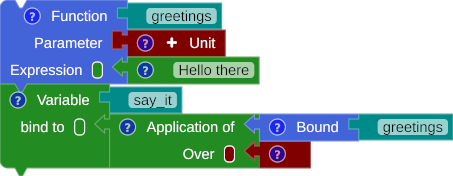
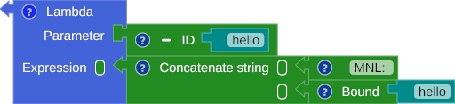

## Just Drag, Drop, and Attach the block

## Variable
{title="Variable binding"}

## Operator

### Unary
{title="Boolean Operator Not"}

### Binary
{title="Arithmetic Operator"}

## Function
{title="First class function"}

## Lambda
{title="Lambda"}

## Selection
{title="Selection"}

## Pattern Matching
{title="Pattern Matching"}