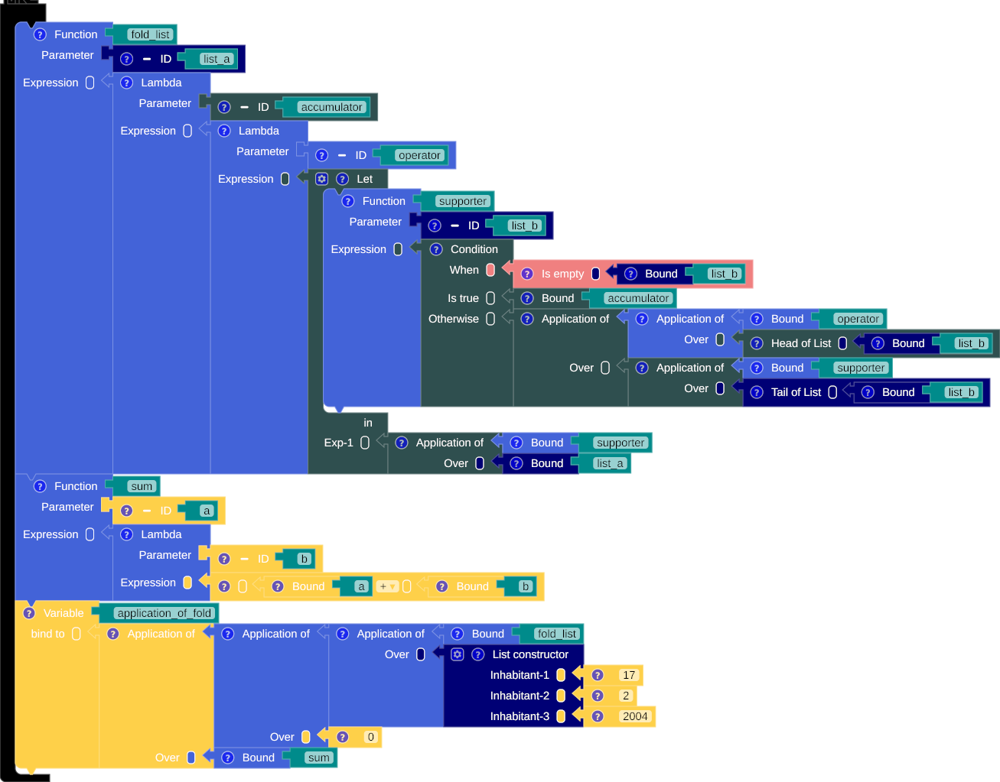
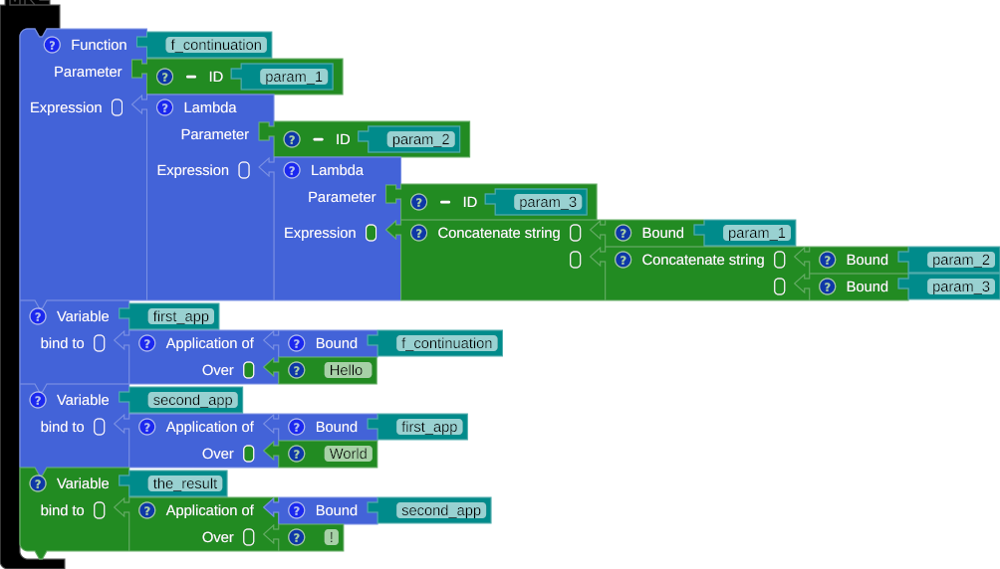

# The Higher-Order Function (HOF)

A higher-order function (HOF) is a function that can take another function as an input (parameter) or return a function as its output, or both.


## Function as a parameter

{title="A function as a parameter"}

/// caption
Fig. 1: A function as a parameter
///

=== "SML"

    ``` sml linenums="1"
        fun fold_list (list_a) = fn (accumulator) => fn (operator) => let
          fun supporter (list_b) = if null(list_b)
            then
            accumulator
            else
            operator(hd(list_b) ) (supporter(tl(list_b) ) )
        in
          supporter(list_a)
        end
        fun sum (a) = fn (b) => (a + b)
        val application_of_fold = fold_list([17, 2, 2004]) (0) (sum)
    ```

=== "Scala"

    ``` scala linenums="1"
    /* Scala doesn't support type variable on lambda */
    ```


## Return a function

{title="Return a function"}

/// caption
Fig. 2: Return a function
///

=== "SML"

    ``` sml linenums="1"
      fun f_continuation (param_1) = fn (param_2) => fn (param_3) => (param_1 ^ (param_2 ^ param_3) )
      val first_app = f_continuation("Hello ")
      val second_app = first_app("World")
      val the_result = second_app("!")
    ```

=== "Scala"

    ``` scala linenums="1"
      def f_continuation (param_1: String) : (String) => (String) => String = (param_2 : String) => (param_3 : String) => (param_1 + (param_2 + param_3) )
      val first_app = f_continuation("Hello ")
      val second_app = first_app("World")
      val the_result = second_app("!")
    ```

