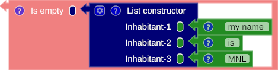

# The List

A list is a container with a collection of items of the same type. It can either be empty or contain one or more items.

## Constructing the list

### Empty list

Constructing an empty list block, simply remove all members from the input block toolbox [[&#9881;](overview.md#block-anatomy)].


/// caption
Fig. 1: The empty list block
///

=== "SML"

    ``` sml linenums="1"
    []
    ```

=== "Scala"

    ``` scala linenums="1"
    List()
    ```


/// caption
Fig. 2: Connecting the empty list block to the variable block
///

=== "SML"

    ``` sml linenums="1"
    val list_constructor = []
    ```

=== "Scala"

    ``` scala linenums="1"
    val list_constructor = List()
    ```


### Non-empty list

The inhabitants of the list can be added or removed using the input block toolbox.


/// caption
Fig. 3: Constructing the non-empty list block
///

=== "SML"

    ``` sml linenums="1"
    ["my name ", "is ", "MNL"]
    ```

=== "Scala"

    ``` scala linenums="1"
    List("my name ", "is ", "MNL")
    ```


/// caption
Fig. 4: Connecting the non-empty list block to the variable block
///

=== "SML"

    ``` sml linenums="1"
    val list_constructor = ["my name ", "is ", "MNL"]
    ```

=== "Scala"

    ``` scala linenums="1"
    val list_constructor = List("my name ", "is ", "MNL")
    ```

## Operator

### is empty

To check whether the list is empty, return true when it is empty; otherwise, return false.


/// caption
Fig. 5: The is-empty block operator with the empty list block
///

=== "SML"

    ``` sml linenums="1"
    val list_constructor = null([])
    ```

=== "Scala"

    ``` scala linenums="1"
    val list_constructor = List().isEmpty
    ```



/// caption
Fig. 6: The is-empty block operator with the non-empty list block
///

=== "SML"

    ``` sml linenums="1"
    val list_constructor = null([])
    ```

=== "Scala"

    ``` scala linenums="1"
    val list_constructor = List().isEmpty
    ```

### head

Retrieve the first inhabitant from the list. 


/// caption
Fig. 7: The head list operator block
///

=== "SML"

    ``` sml linenums="1"
    hd(["My name ", "is ", "MNL"])
    ```

=== "Scala"

    ``` scala linenums="1"
    List("My name ", "is ", "MNL").head
    ```


### tail

Obtain the inhabitants of the list, starting from the second inhabitant to the last one.


/// caption
Fig. 8: The tail list operator block
///

=== "SML"

    ``` sml linenums="1"
    tl(["My name ", "is ", "MNL"])
    ```

=== "Scala"

    ``` scala linenums="1"
    List("My name ", "is ", "MNL").tail
    ```

### append

Insert a new inhabitant into the list and put it into the first position.


/// caption
Fig. 9: The append list operator block
///

=== "SML"

    ``` sml linenums="1"
    ("Hello, " :: ["My name ", "is ", "MNL"])
    ```

=== "Scala"

    ``` scala linenums="1"
    ("Hello, " :: List("My name ", "is ", "MNL"))
    ```


/// caption
Fig. 10: The append a new inhabitant and bind to a variable block.
///

=== "SML"

    ``` sml linenums="1"
    val my_name_is_mnl = ["My name", "is", "MNL"]
    val hello = ("Hello, " :: my_name_is_mnl)
    ```

=== "Scala"

    ``` scala linenums="1"
    val my_name_is_mnl = List("My name", "is", "MNL")
    val hello = ("Hello, " :: my_name_is_mnl)
    ```


## Example

### Sum


/// caption
Fig. 11: The head list operator block
///

=== "SML"

    ``` sml linenums="1"
    fun sum_list (list_a) = if null(list_a)
      then
        0
      else
        (hd(list_a)  + sum_list(tl(list_a)))

    val sum_list_application = sum_list([17, 2, 200, 4])
    ```

=== "Scala"

    ``` scala linenums="1"
    def sum_list (list_a: List[Float]) : Float = if (list_a.isEmpty)
      then
        0
      else
        ((list_a.head)  + sum_list((list_a.tail)))

    val sum_list_application = sum_list(List(17, 2, 200, 4))
    ```
