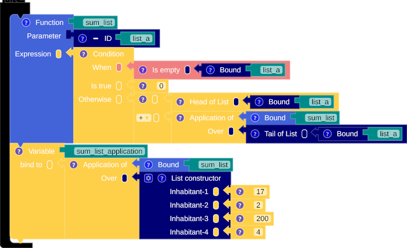

## Constructing the list

The list type is a container type with a collection of homogeneous member types.

### Empty list


=== "SML"

    ``` sml linenums="1"
    []
    ```

=== "Scala"

    ``` scala linenums="1"
    List()
    ```


=== "SML"

    ``` sml linenums="1"
    val list_constructor = []
    ```

=== "Scala"

    ``` scala linenums="1"
    val list_constructor = List()
    ```


### Non-empty list


=== "SML"

    ``` sml linenums="1"
    ["my name ", "is ", "MNL"]
    ```

=== "Scala"

    ``` scala linenums="1"
    List("my name ", "is ", "MNL")
    ```


=== "SML"

    ``` sml linenums="1"
    val list_constructor = ["my name ", "is ", "MNL"]
    ```

=== "Scala"

    ``` scala linenums="1"
    val list_constructor = List("my name ", "is ", "MNL")
    ```

## Operator

### is empty


=== "SML"

    ``` sml linenums="1"
    val list_constructor = null([])
    ```

=== "Scala"

    ``` scala linenums="1"
    val list_constructor = List().isEmpty
    ```


=== "SML"

    ``` sml linenums="1"
    val list_constructor = null([])
    ```

=== "Scala"

    ``` scala linenums="1"
    val list_constructor = List().isEmpty
    ```


### head


=== "SML"

    ``` sml linenums="1"
    hd(["My name ", "is ", "MNL"])
    ```

=== "Scala"

    ``` scala linenums="1"
    List("My name ", "is ", "MNL").head
    ```


### tail


=== "SML"

    ``` sml linenums="1"
    tl(["My name ", "is ", "MNL"])
    ```

=== "Scala"

    ``` scala linenums="1"
    List("My name ", "is ", "MNL").tail
    ```


### append


=== "SML"

    ``` sml linenums="1"
    ("Hello, " :: ["My name ", "is ", "MNL"])
    ```

=== "Scala"

    ``` scala linenums="1"
    ("Hello, " :: List("My name ", "is ", "MNL"))
    ```


## Example

### Sum


=== "SML"

    ``` sml linenums="1"
    fun sum_list (list_a) = if null(list_a)
      then
        0
      else
        (hd(list_a)  + sum_list(tl(list_a)))

    val sum_list_application = sum_list([17, 2, 200, 4])
    ```

=== "Scala"

    ``` scala linenums="1"
    def sum_list (list_a: List[Float]) : Float = if (list_a.isEmpty)
      then
        0
      else
        ((list_a.head)  + sum_list((list_a.tail)))

    val sum_list_application = sum_list(List(17, 2, 200, 4))
    ```
