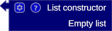
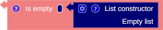
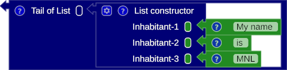
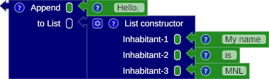

## Constructing the list

The list type is a container type with a collection of homogeneous member types.

### Empty list

### Not empty list

## Operator

### is empty

### head

### tail

### append

## Example

### Sum
