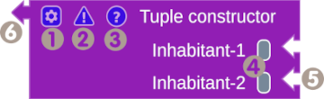
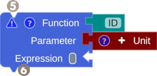
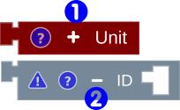

# Overview

## Workspace

The MnL workspace is divided into Menu, Toolbox and Top-level block, and Playground.

/// caption
Fig. 1: Workspace
///

### Menu

:material-numeric-1-circle: `File`: start a new workspace, save and download blocks on the Playground, or upload and load blocks into the Playground.

:material-numeric-2-circle: `Theme`: change the workspace theme to dark or light mode.

:material-numeric-3-circle: `Basic Example`: load basic examples such as the identity and recursive functions, etc.

:material-numeric-4-circle: `Advanced Example`: load an advanced example such as the filter, fold, or fmap function.

:material-numeric-5-circle: `Program Visualization and Transpiler`: show/ hide window of the function value, beta reduction, or transpiler.

:material-numeric-6-circle: `Usage`: go to the user guide website.

   

### Toolbox and Top-level block

:material-numeric-7-circle: `Toolbox icon`: clickable icon to show or hide toolbox.

:material-numeric-8-circle: `Search`: search block by name.

:material-numeric-9-circle: `Top-level block`: used as the parent block for the program construction.. 

### Playground

:material-alpha-a-circle: `Trash`: hold all deleted blocks.

:material-alpha-b-circle: `Zoom in/out`: Zoom in/ out of the play area.

:material-alpha-c-circle: `Rest`: reset the play area position.

:material-alpha-d-circle: `Play Area`: holds all blocks.

## Toolbox

Toolbox groups the blocks based on the language grammar. To show the block in the category, click the category. There are seven categories on the top; the other seven below are part of the expression. The user can also search the block from the search box located at the bottom of the toolbox.

/// caption
Fig. 2: Toolbox
///

## Block Anatomy

/// caption
Fig. 3: Horizontal input/output block
///

/// caption
Fig. 4: Vertical input/output + horizontal input block
///

:material-numeric-1-circle: `Gear Icon`: show the add/remove input block toolbox.

:material-numeric-2-circle: `Exclamation Mark Icon`: Debugger, shows the error message.

:material-numeric-3-circle: `Question Mark Icon`: The Info shows the block information: block category, type, and value.

:material-numeric-4-circle: `Suggestion Box Color`: shows the colors of blocks that can be connected.

:material-numeric-5-circle: `The Input Notch`: shows the shape of the required output notch to attach to the block.

:material-numeric-6-circle: `The Output Notch`: used as a hook to another block.

## Add/Remove Input 

The number of input blocks on some blocks can be adjusted dynamically using the add/remove toolbox or add/remove icon.

/// caption
Fig. 5: Add/remove input toolbox
///

/// caption
Fig. 6: Add/remove input using icon
///

## Block Info

The Info shows block information such as block category based on the grammar, value type (term type), and value.

/// caption
Fig. 7: The Info
///

### The Shape and Color

The shape of the input/output notch of the block represents the non-terminal of the grammar. The block color represents the term type, such as blue for function, yellow for number, etc..

### Debugger

The debugger shows the requirement to make a complete block (1) or the term-type error.

1. :man_raising_hand: A complete block is a block with all requirements fulfilled, ex.: Fig.7 The Info.

/// caption
Fig. 8: Debugger
///