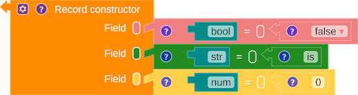
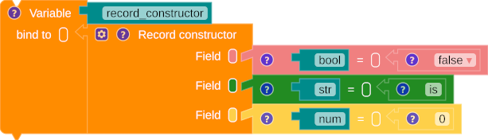
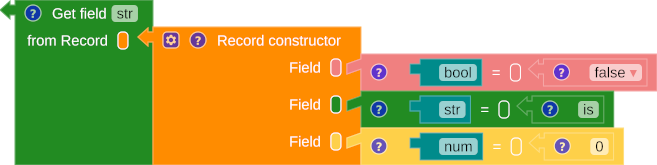
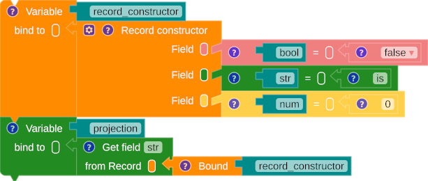

# Record

A record is a data structure that comprises a fixed number of fields. Each field has an identifier and an associated expression. In contrast with a tuple, where the names of the fields are implicitly assigned based on their order, a record allows users to define the names of its fields.

## Constructor

{title="Record constructor"}

/// caption
Fig. 1: Record constructor
///

=== "SML"

    ``` sml linenums="1"
    {bool = false, str = "is", num = 0}
    ```

=== "Scala"

    ``` scala linenums="1"
    /* Scala doesn't have primitive type of 'Record' */
    ```

{title="Record binding with a name"}

/// caption
Fig. 2: Binding a record constructor with a name
///

=== "SML"

    ``` sml linenums="1"
    val record_constructor = {bool = false, str = "is", num = 0}
    ```

=== "Scala"

    ``` scala linenums="1"
    /* Scala doesn't have primitive type of 'Record' */
    ```

## Projection

Projection is an operator that retrieves a specific field using its name.

{title="Record projection"}

/// caption
Fig. 3: Record projection
///

=== "SML"

    ``` sml linenums="1"
    (#str {bool = false, str = "is", num = 0})

    ```

=== "Scala"

    ``` scala linenums="1"
    /* Scala doesn't have primitive type of 'Record' */
    ```

{title="Application of record projection over a bound variable"}

/// caption
Fig. 4: Application of record projection over a bound variable.
///

=== "SML"

    ``` sml linenums="1"
    val record_constructor = {bool = false, str = "is", num = 0}
    val projection = (#str record_constructor)
    ```

=== "Scala"

    ``` scala linenums="1"
    /* Scala doesn't have primitive type of 'Record' */
    ```