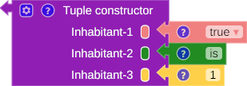
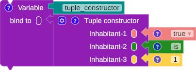
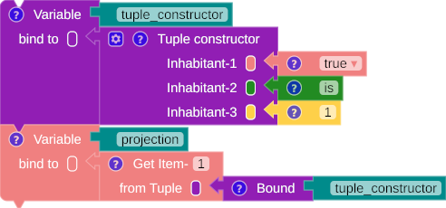

# Tuple

A tuple is a container with a collection of inhabitants with the same or different term types. Its size is fixed, and it cannot be empty.

## Constructor

{title="Tuple constructor"}

/// caption
Fig. 1: Tuple constructor
///


=== "SML"

    ``` sml linenums="1"
    (true, "is", 1)
    ```

=== "Scala"

    ``` scala linenums="1"
    (true, "is", 1)
    ```

{title="Binding a tuple"}

/// caption
Fig. 2: Binding a tuple
///

=== "SML"

    ``` sml linenums="1"
    val tuple_constructor = (true, "is", 1)
    ```

=== "Scala"

    ``` scala linenums="1"
    val tuple_constructor = (true, "is", 1)
    ```

## Projection

Projection is an operator that retrieves one element from a tuple at a specific location.

{title="Tuple projection"}

/// caption
Fig. 3: Tuple projection
///

=== "SML"

    ``` sml linenums="1"
    val tuple_constructor = (true, "is", 1)
    val projection = (#1 tuple_constructor)
    ```

=== "Scala"

    ``` scala linenums="1"
    val tuple_constructor = (true, "is", 1)
    val projection = (tuple_constructor(1))
    ```