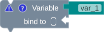
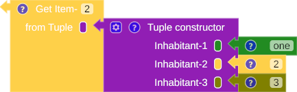

# Type Inference

The term type of the variable block (Fig. 1) and operator block (Fig. 2) depends on the attached block. If the block is incomplete, its default term type is `any`.

{title="The variable type is any "}

/// caption
Fig. 1: The variable block term type is `any`
///

{title="The operator block term type is any"}

/// caption
Fig. 2: The operator block term type is any
///

When the operator block is complete, it will implicitly infer the term type. For example, the variable block term type on Fig. 3 is inferred from the `ASCII to Character block` term type, and the operator block term type on Fig. 4 is inferred from the second inhabitant of `the tuple constructor block`.

{title="Infer the term type form operator"}

/// caption
Fig. 3: Infer the term type form operator
///

{title="The operator block term type is number"}

/// caption
Fig. 4: The operator block term type is `number`
///