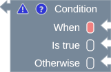
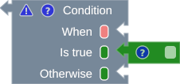
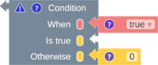
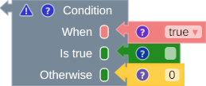
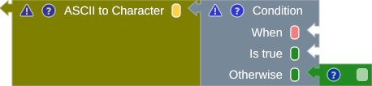

# Type Suggestion

One of MNL's capabilities is type suggestion. MNL will show the suggestion type by coloring the rounded box near the input notch.
 
Initially, MNL will color the suggestion box with the color of the term type `any` (dark silver), but when the term type is successfully inferred, the color will change accordingly.

{title="The incomplete block"}

/// caption
Fig. 1: Suggestion type on the incomplete block
///

However, when the block has some attached input (The partially completed block (1) ), MNL will construct the type based on the type constraint rule and update the suggestion box color. The example below shows the color of the suggestion box on the input notch.

1. :man_raising_hand: The partially completed block has a block with some attached input blocks, but not all input notches have connected with the input block.

{title="The partially completed block"}

/// caption

///

{title="The partially completed block"}

/// caption
Fig. 2: The partially completed block
///

Users can check whether the input block complies with the typing rule when it is complete. For example, the completed block below, the input block attached to the otherwise input, does not comply with the typing rule. The typing rule required the block with the green color (2), but it found the block with the yellow color (3).

1. :man_raising_hand: The completed block is a block with all input notches connected to the input block.
2. :man_raising_hand: The green color is the color for the type string.
3. :man_raising_hand: The yellow color is the color for the type number.

{title="The completed block"}

/// caption
Fig. 3: The completed block
/// 

When the type constraint builder cannot find the type from the attached input block, but the block has a parent block, it will infer the type from the parent block.

{title="Infer from the parent block"}

/// caption

///

{title="Infer from the parent block"}

/// caption
Fig. 4: Infer from the parent block
///

The type constraint builder tries to infer the type from the attached input block first, then the parent block. 

{title="Start from the attached block, then the parent block"}

/// caption
Fig. 5: Start from the attached block, then the parent block
///
